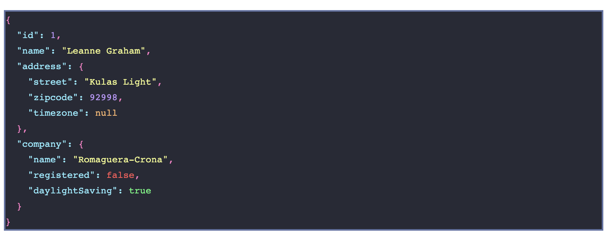

# svelte-debugger

[![npm][badge-version]][npm]
[![bundle size][badge-size]][bundlephobia]
[![license][badge-license]][license]

A debugger component for [Svelte][svelte] apps.



## Installation

```bash
npm install svelte-debugger --save
```

or

```bash
yarn add svelte-debugger
```

## Usage

```html
<script>
  import Debugger from 'svelte-debugger';
</script>

<Debugger data={example} />
```

## Properties

```html
<Debugger
  data={example}
  indent={2}
  colorOptions={{ falseColor: '#ff3e00', trueColor: '#40b3ff' }}
/>
```

- `data`: object to debug
- `indent`: `number` size of spaces between _keys_ and _values_
- `colorOptions`: `object` containing at least one of the properties `keyColor`, `numberColor`, `stringColor`, `trueColor`, `falseColor`, `nullColor`.

[svelte]: https://svelte.dev/
[badge-version]: https://img.shields.io/npm/v/svelte-debugger.svg
[npm]: https://www.npmjs.com/package/svelte-debugger
[badge-size]: https://img.shields.io/bundlephobia/minzip/svelte-debugger.svg
[bundlephobia]: https://bundlephobia.com/result?p=svelte-debugger
[badge-license]: https://img.shields.io/npm/l/svelte-debugger.svg
[license]: https://github.com/ftonato/svelte-debugger/blob/master/LICENSE

## License

[MIT](LICENSE)
